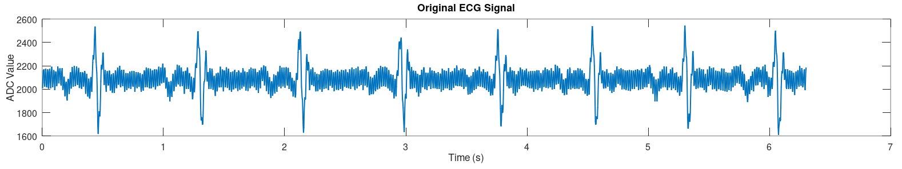
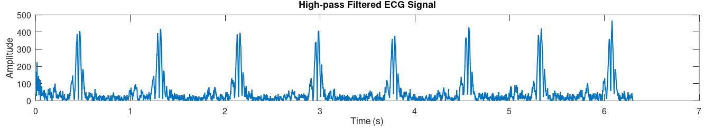

# Algorithm prototyping
## Directory overview
[`algorithm.m`](algorithm/algorithm.m) - An Octave script for design, implementation, and visualization of the signal conditioning, R-peak detection, and heart rate calculation program used by this project.

[`algorithm.c`](algorithm/algorithm.c) - A real-time C adaptation of the program contained in the Octave script, optimized for minimal time and memory complexity.

[`plot_output.m`](algorithm/plot_output.m) - An Octave script to plot the output waveforms produced by the C program, for debugging purposes.

[`scope.csv`](algorithm/scope.csv) - Several seconds of an ECG signal captured by a serial oscilloscope for testing purposes; see [`firmware/`](firmware/) for more details about the prototype used to capture this data.
## Design process
### Hum's the Word: Removing powerline interference
Before starting, we would like a signal that closely replicates what the ADC on our final PCB would read. Stock configuration on the AD8232 evaluation board is intended for measurements taken from the hands and has a passband of 7 to 24 Hz, which we will very likely modify for our final design. However, the algorithm should be resilient to changes in filtering and should therefore be valid for our purposes here.



The raw signal presents three immediate challenges:
1. Large DC offset
2. Mains noise prevalence
3. Noticeable waveform distortion (P and T waves are indiscernable)

We know the DC component dominates, so let's discard it before plotting the frequency spectrum up to the Nyquist frequency of 180 Hz:


The narrow passband means that signal contents lay in the 0-30 Hz range with a dominant frequency at exactly 60 Hz, confirming our observation about the mains hum earlier. We want this design to work with electrode cables without any EMI shielding and we also want to retain the ability to use the signal for cardiac monitoring, so filtering will have to be done in the digital domain. A Notch filter allows us to strongly attenuate this particular frequency while introducing minimal distortion to the rest of the signal.

Using Octave's `pei_tseng_notch()` function means we only need to use a bit of trial-and-error to find the minimum bandwidth that effectively suppresses the 60 Hz noise, which visually occurs around 5 Hz, and yields a filter with an attentuation reaching nearly -30 dB:


Here is the resultant signal, which now has something resembling a P-wave. The DC offset is still present but is addressed during R-peak detection, detailed below.


### A Tribe Called QRS: Implementing heart rate detection
Every prominent R-peak detection algorithm has three distinct stages: signal conditioning, thresholding, and R-peak searching. This project uses an [algorithm published in 2019](../docs/papers/Low_Resource_R-Peak_Detection_Triangle_Template_Match_Moving_Avg_Filter.pdf) that improves upon previous approaches by introducing a triangle template matching filter to reduce the resource complexity present in other algorithms used in embedded devices. 

The signal conditioning filters depend on a set of parameters that depend on the sampling frequency $f_\text{s}$. The paper provides their recommendations for the canonical rate of $f_\text{s} = \text{360 Hz}$ as well as a procedure for determining some of them given $f_\text{s}$.

<div align="center">

| Parameter | Description | Value |
|---|---|---|
| $f_\text{s}$ | Sampling frequency | $\text{360 Hz}$ |
| $N$ | $h[i]$ window radius | $25$ |
| $s$ | $t[i]$ parameter | $7$ |
| $L$ | $l_1[i]$ window radius | $5$ |
| $M$ | $l_2[i]$ window radius | $150$ |
| $\beta$ | Threshold coefficient | $2.5$ |
| $\theta$ | Threshold offset | $\text{mean}(l_1[i])/4$ |

</div>

With the parameters set, we introduce some notation for a moving average filter centered around the current element (assume the signal is zero-padded):

$$\text{MA}(x[i],R):=\frac{1}{2R+1}\sum_{-R}^{R}x[i+R]$$
And the triangle template matching filter:
$$\text{TR}(x[i],R):=(x[i]-x[i-R])(x[i]-x[i+R])$$
With our notched ECG signal above denoted as $\text{ECG}[i]$, we begin cascading filters. The first is a high-pass filter:
$$\overline{\text{ECG}}[i] = \text{MA}(\text{ECG}[i],N)$$
$$\hat{h}[i] = \text{ECG}[i] - \overline{\text{ECG}}[i]$$
$$h[i] = |\hat{h}[i]|$$
With DC noise and negative values forgone, we have a signal suitable for peak detection:



Next is the triangle filter, $t[i]=\text{TR}(h[i],s)$, which accentuates the QRS complex:


Finally, the thresholding filters:
$$l_1[i] = \text{MA}(t[i],L)$$
$$l_2[i] = \text{MA}(t[i],M)$$
$$\text{threshold}[i] = \beta l_2[i] + \theta$$

The first low pass filter, $l_1$, is used to "smoothen out" the output of the triangle filter while $l_2$ is used to set the threshold value. The result is


Regions where $l_1$ (blue plot) is greater than the threshold value (red plot) are considered an AOI (area of interest) and maxima within each area are considered R-peaks. An error correction step must also be applied, however. Because the peaks produced by $l_1$ are not perfectly convex, AOIs that should be one contiguous region are sometimes detected as two separate regions. For an example of this, notice how the fourth QRS region in $l_1$ crosses the threshold, dips back down, and crosses over once again, resulting in false positives. To ameliorate this, the algorithm leverages the fact that the the theoretical maximum heart rate is 206 bpm, so when a detected R-R interval which exceeds this value the lower amplitude R-peak is discarded. With these rules applied, the detected R-peaks look like:


The heart rate readings, in units of bpm, are trivially calculated as $60/\text{RR}$, where $\text{RR}$ is the distance between successive R-peaks.

### Silence of the RAMs: Adaptations for a real-time environment

A naively implemented moving average filter poses a problem for real-time systems, which continuously compute filter outputs:
1. It requires division of very large numbers, or numerous (in our case, hundreds of) division operations to compute a single point.
2. It's noncausal, meaning we'll need to introduce signal buffers and keep track of how many samples have been read.

Let's begin with the recursive definition of the moving average filter:

$$\text{MA}(x[i],R):=\text{MA}(x[i-1],R)+\frac{1}{2R+1}\biggl(x[i+R]-x[i-(R+1)]\biggr)$$

This is a lot more efficient, but still requires the first $2R+1$ outputs to be computed before the outputs are valid, so we use an accumulator to incrementally compute the average before "turning on" the subsequent filter. Also note that the centering of the window is irrelevant, and only the number of samples read must be kept track of. This leads to the following pseudocode:

```
macro window(R)
    2 * R + 1
end macro

acc = 0
num_samples = 0

while true do
    acc = acc + newest_val / window(R)
    
    if num_samples > window(R) then
        acc = acc - oldest_val / window(R)
    end if

    num_samples = num_samples + 1
end while
```

In this case `oldest_val` is the sample which just outside of the current sampling window, which means that the buffer size for a signal that is moving average-filtered must be one greater than the window size, or $2R+2$.

For the signal being fed into the reverse template matching filter, $h[i]$, the domain varies from $i-R$ to $i+R$ so the input signal buffer size need only be equal to $2R + 1$. The computation is relatively simple so no optimizations are needed.

Our final consideration is the value of $\theta$ in the threshold computation. The paper this algorithm is based upon states that $\theta$ *could be one-fourth of the statistical mean of the output of the low-pass filter*, and they go on to use a pre-determined value calculated on their expansive database. Because we don't have this luxury, we leverage the fact that our second low-pass filter uses a large enough window size that the difference between its output and the true mean of the signal is negligible so we can set $\theta = l_2[i] / 4$ and compute it in real time.

## The Idea Graveyard
**More rigorous testing:** While the authors of the peak detection algorithm have thoroughly tested it on the MIT-BIH Arrhythmia Database and benchmarked it against several other popular algorithms, our proprietary real-time adaptation could benefit from additional validation. This could include unit testing helper functions and computing error in time differences (compared to ground truth data) between R-R peaks that are introduced by rounding and truncation in the C language.

**Use an FIR notch filter:** A significant advantage of our peak detection algorithm is its exclusive use of finite impulse response (FIR) filters for all necessary signal conditioning. This ensures stability, linear phase, and prevents potential positive feedback loops from quantization noise or electrode issues. Our additional Notch filter uses past output values and is therefore an IIR filter, but a [wise choice of zeroes](https://tttapa.github.io/Pages/Mathematics/Systems-and-Control-Theory/Digital-filters/FIR-Notch.html) for the transfer function might make an FIR filter with our desired characteristics possible.

**Employ a state machine:** The current real-time implementation relies on nested if-statements to manage delays between cascaded filters and execute the peak detection logic. A single state machine would increase code legibility and make debugging an easier task.

**Replace linear buffers with a deque:** Our current real-time implementation uses arrays as signal buffers, which are shifted every sampling period once filled. However, only 5 operations are needed to compute any filter in the R-peak detection algorithm:

  - `peek_front()`
  - `pop_front()`
  - `peek_rear()`
  - `pop_rear()`
  - `peak_middle()`
  
  A double-ended queue could be implemented to easily include these functions. Doing so would mean we wouldn't waste so many clock cycles shifting arrays. However, a deque requires storing the memory address of each node. Given that RAM size is a more restrictive factor than processing power in our case, we chose to use linear buffers. This keeps the stack size under 5 kB.