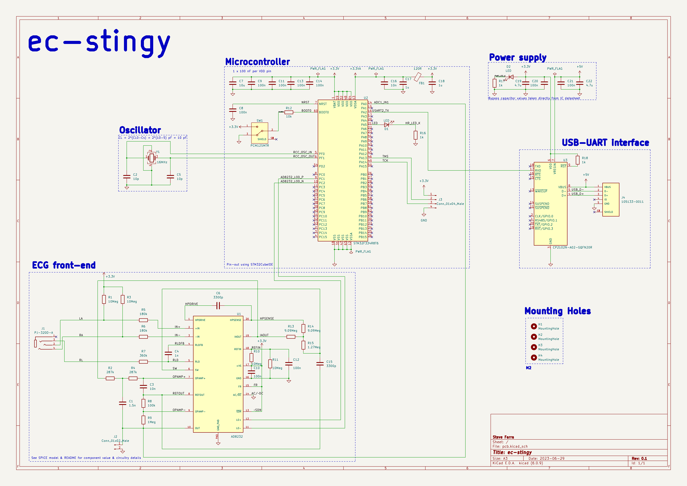
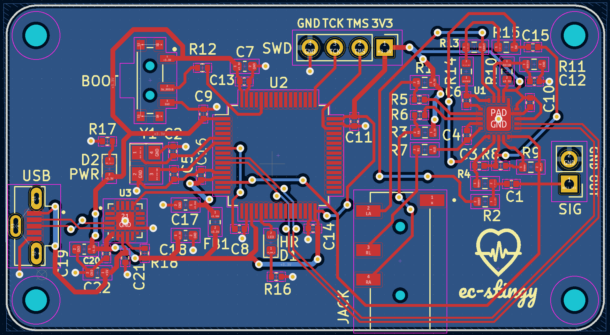
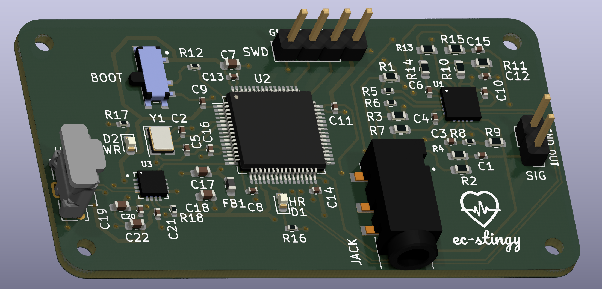

# PCB Design
## Directory overview
Several files containing project metadata are included in this directory, but the most important ones to be aware of are:

[`pcb.kicad_pro`](pcb.kicad_pro): KiCad 6 project file. Use this to properly load and open the schematic and layout files.

[`pcb.kicad_sch`](pcb.kicad_sch): The schematic file.

[`pcb.kicad_pcb`](pcb.kicad_pcb): The layout file.

[`libraries/`](libraries/): Contains symbols, footprints, and 3D models for components used in the project that are included in the KiCad library.

[`manufacturing/`](manufacturing/): Contains a bill of materials, a component placement file, and gerber files required to get the board produced.

## V for Via: Establishing a workflow
The overall design and microcontroller layout is heavily inspired by the [KiCad 6 STM32 tutorial](https://www.youtube.com/watch?v=aVUqaB0IMh4&pp=ygUNc3RtMzIga2ljYWQgNg%3D%3D) with a few notable additions:

- The AD8232 and all of its associated circuitry (a near replica of the SPICE model in this project)
- The CP2102N USB-to-UART bridge controller, which acts as both a voltage regulator and PC interface in this design

Several peripherals are also added for ease-of-use and debugging purposes:

- A micro-USB port, to power the board
- A 3.5 mm jack, to plug the electrode cable into
- A boot switch, to reset the microcontroller
- A serial wire debug pin header, to modify the firmware
- An ECG signal pin header, to inspect the analog signal
- LEDs to indicate a power connection and heartbeat readings, respectively

The schematic ends up falling into roughly into 5 sections:

Before approaching the layout, we first consult PCB layout guidelines provided by the various ICs used. From the AD8232 datasheet:

> Keep all of the connections between high impedance nodes as short as  possible to avoid introducing additional noise and errors from  corrupting the signal. To maintain high CMRR over frequency, keep the input traces  symmetrical and length matched. Place safety and input bias  resistors in the same position relative to each input. In addition,  the use of a ground plane significantly improves the noise rejection of the system.

And from the STM32 datasheet:

> Each power-supply pair (VDD/VSS, VDDA/VSSA etc..) must be decoupled with filtering  ceramic capacitors as shown above. These capacitors must be placed as close as possible to or below the appropriate pins on the underside of the PCB, to ensure the good functionality of the device. The 10 nF capacitor must be ceramic (good quality) and it must be placed as close as possible to the chip.

With these principles in mind, a heavy draw of inspiration from the layout of the [SparkFun AD8232 breakout](https://www.sparkfun.com/products/12650), and a modest amount of trial-and-error, the resultant two-layer board layout came out like so:

And its corresponding 3D model:

## The Cutting Room Floor
**Get it reviewed:** Although this schematic and layout pass KiCad's electrical and design rule checkers, having a formal review done by a third-party to validate it and ensure it follows best-practices on aspects like differential trace length matching, passive component sizing, and decoupling capacitor layout would help avoid any potentially costly or time-consuming mistakes before submitting it to the manufacturer.

**Add safeguards:** Replacing the PC power supply with an external battery, adding TVS diodes to sensitive traces for ESD protection, and using an optocoupler to provide electrical isolation between the patient and the ECG would all increase the device's overall safety.

**Compactify the layout:** The board size comes in at roughly 61 mm by 33 mm, but there is still quite a bit of unused space which could be used for more peripherals or done away with altogether by rearranging components.

**Design an enclosure:** A hard casing with cutouts to access the peripherals and to view the LEDs would be a nice addition to this project; the board already includes mounting holes that could be used to fasten it. KiCad's [StepUp](https://www.kicad.org/external-tools/stepup/) tool allows the 3D model above to be easily imported into FreeCAD and would come in handy here.