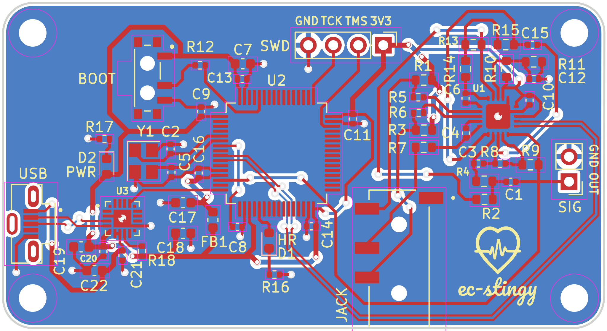

# PCB Files
## Directory overview
## V for Via: Establishing a PCB design workflow
The process of developing this board is largely based on the [KiCad 6 STM32 tutorial](https://www.youtube.com/watch?v=aVUqaB0IMh4&pp=ygUNc3RtMzIga2ljYWQgNg%3D%3D) from Phil's Lab, which turned out to be tremendous educational resouce that informed a large part of this project. 

The AD8232 datasheet includes PCB layout guidelines:

> Keep all of the connections between high impedance nodes as short as  possible to avoid introducing additional noise and errors from  corrupting the signal. To maintain high CMRR over frequency, keep the input traces  symmetrical and length matched. Place safety and input bias  resistors in the same position relative to each input. In addition,  the use of a ground plane significantly improves the noise rejection of the system.

And from the STM32 datasheet:

> Each power-supply pair (VDD/VSS, VDDA/VSSA etc..) must be decoupled with filtering  ceramic capacitors as shown above. These capacitors must be placed as close as possible to or below the appropriate pins on the underside of the PCB, to ensure the good functionality of the device. The 10 nF capacitor must be ceramic (good quality) and it must be placed as close as possible to the chip.

With these principles in mind, the resultant board layout came out like so:

