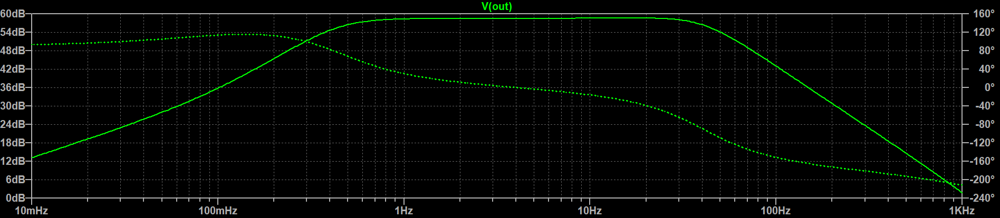
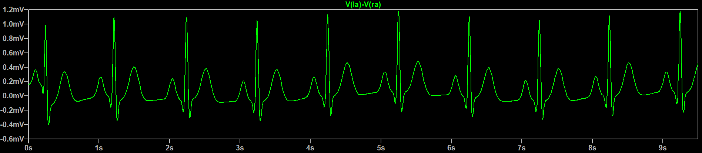
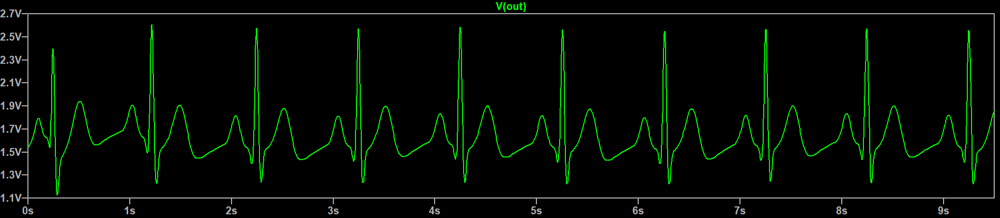
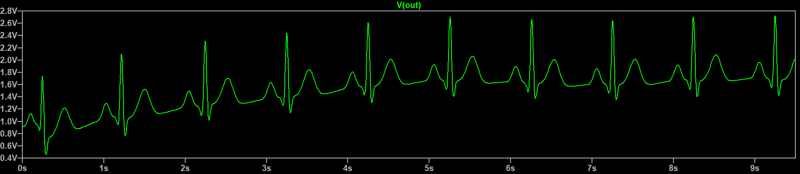
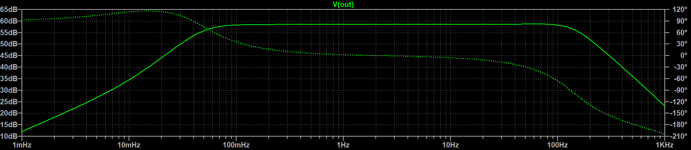

# SPICE simulations
## Directory overview
[`ecgsyn.m`](spice/ecgsyn_m), [`derivsecgsyn.m`](spice/derivsecgsyn.m) - These are MATLAB scripts sourced from [ECGSYN](https://physionet.org/content/ecgsyn/1.0.0/), a realistic ECG waveform generator open-sourced under the GNU General Public License and used in this project by `gen_ecg.m`.

[`gen_ecg.m`](spice/gen_ecg.m) - An Octave script for generating an ECG waveform suitable for transient analysis in LTspice.

[`AD8232.cir`](spice/AD8232.cir) - An LTspice model for the AD8232 chip, which is the analog front-end of choice for this project.

[`AD8232.asy`](spice/AD8232.asy) - An LTspice symbol for the AD8232.

[`ecg_front-end.asc`](spice/ecg_front-end.asc) - An LTspice schematic for the AD8232 in the cardiac monitor configuration specified in the datasheet. This file contains simulation commands for both frequency and transient analyses.

## Ohm is Where the Heart is: Widening the filter passband

This project uses the AD8232 to interface with the MCU and provide it with a signal suitable for the ADC. The datasheet for this IC provides several example configurations depending on the use case. We want to introduce minimal signal distortion at this stage and use as wide of a passband as possible for maximum versatility. The application circuit with the largest bandwidth is the cardiac monitor configuration, which employs a 0.5 Hz two-pole high-pass filter followed by a two-pole, 40 Hz low-pass filter.

This configuration is a good starting point for our own design but will be insufficient for diagnostic purposes. As [this paper from 2012](https://pubmed.ncbi.nlm.nih.gov/22778996/) points out, interpretation of the ST segment of an ECG should only be carried out with a cut-off frequency of 0.05 Hz, as 0.5 Hz introduces considerable distortion to this particular segment.

Although there doesn't seem to be a definitive cut-off on the high end, most sources suggest clinical ECGs typically have a cut-off of 100 or 150 Hz. There may be good reason to extend even further; recent research suggests that detection of myocardial ischemia, a certain heart condition, is improved through high-frequency QRS analysis, which commonly occurs in the frequency range between 150 and 250 Hz according to this 2012 paper. This extends far beyond our Nyquist frequency of 180 Hz, however, so to avoid changing our sample rate and diverging from industry standards we'll aim for a high pass frequency cut-off of 150 Hz.

We start by simulating the provided cardiac monitor configuration and then modifying it as needed. To ensure our set-up is correct, we compare the bode plot provided in the datasheet with our simulated version and ensure the midband gain, roll-off, and cut-off frequencies are consistent with one another using the cursor tool:

We also perform a transient analysis with a simulated ECG signal sourced across the two leads:

With a gain of 1100 and a passband of 0.5 to 40 Hz, our simulated output signal looks like:

The filters have managed to remove the baseline wandering, added a DC offset, and amplified the signal considerably while preserving its general shape. Although the ST segment (and the distortion thereof) is hard to make out on this timescale, we can see the flatness of the TP segment is not present in the output.

### High-pass filter modification

This design uses the high-pass filter topology of figure 56 in the datasheet, which includes an extra compensation resistor $R_\text{comp}$ to each lower cut-off frequencies with lower $R$ and $C$ values and finer control of the $Q$ factor. Deriving the transfer function from first principles is no trivial task because of the internal transconductance amplifiers and instrumentation amplifier in this stage. Luckily, the datasheet provides us with the cut-off frequency:
$$f_\text{c}=\frac{10}{2\pi \sqrt{R_1 C_1 R_2 C_2}}$$ And a recommended starting point for component value selection:
$$R_1 = R_2 \geq 100\text{ k}\Omega$$ $$C_1 = C_2$$ $$R_\text{comp} = 0.14R_1$$ with the caveat that the above selection of $R_\text{comp}$ optimizes for a maximally flat passband and choosing a value too low can result in an unstable circuit. Our starting configuration of $R_1 = R_2 = 10\text{ M}\Omega$ and $C_1 = C_2 = 0.33 \text{ }\mu\text{F}$ results in a cut-off frequency of about 0.48 Hz. To get to our desired value we only need to lower our cut-off frequency by an order of magnitude. Because our resistors are already quite large and changing their values substantially could lead to higher-order effects, we'll instead increase the size of both capacitors by a factor of 10 to 3300 pF. In simulation this places the cut-off frequency at about 45 mHz, so this time we tweak the resistor values. A 2020 paper mentions that the IEC 60601 standard requires 1% component tolerances for medical devices, so we round down to a resistor value from the E96 series and find that 9.09 MΩ resistors places the cut-off frequency at about 49 mHz. We also adjust the compensation resistor according to the recommendation above and modify its value to 1.27 MΩ. With these modifications, we re-run the transient analysis:

The flatness of the TP segment is preserved, but now the signal takes several seconds to settle! As [this MEDTEQ article](https://www.medteq.net/article/2017/4/1/ecg-filters) explains, lowering the cut-off frequency raises the time constant. This is why the AD8232 includes a fast restore circuit, which briefly connects the filter to internal resistors that shift the poles to a higher frequency and drain $C_1$ and $C_2$ more quickly. It's unclear why the signal takes so long to settle despite the fact that fast-restore is enabled in simulation; the capacitors may simply need to be smaller for the effect to be more apparent. In any case, our digital high pass filter has an extremely fast settling time that takes care of this, so we proceed to modifying the low-pass filter.

### Low-pass filter modification

Our low-pass filter uses the Sallen-Key filter topology from figure 60 described by

$$f_\text{c}=\frac{1}{2\pi \sqrt{R_1 C_1 R_2 C_2}}$$

$$A_v=1+\frac{R3}{R4}$$

$$Q=\frac{\sqrt{R_1 C_1 R_2 C_2}}{R_1 C_2 + R_2 C_2 + R_1 C_1(1-A_v)}$$

At our current gain of $A_v = 11$, $C_2$ must remain several times larger than $C_1$ to maintain stability. Because the constraints on $R_1$ and $R_2$ are less delicate, we start by modifying the resistances. To find a starting point, we set $R_1=R_2$, $f_c=150\text{ Hz}$, and keep the capacitances the same, yielding $R_1=R_2 \approx 274\text{ k}\Omega$. In simulation this sets our cut-off to about 158 Hz, so we round both resistances up to the E96 value of 287 kΩ which corresponds to 151 Hz. With these component values, our $Q$ is also set at roughly 0.77, close to the recommended value of 0.7 for maximum passband flatness and sharp cut off. Here is the bode plot of our finalized design:

## Idea Graveyard
**Build an analog front-end from scratch**: The idea of building the required circuitry using discrete ICs was considered, but the bill of materials just for core functionality -- an in-amp, op-amps, and switches -- quickly exceeded the current price for an AD8232, not to mention the jump in complexity. A high-performance instrumentation amplifier with a high CMRR (common-mode rejection ratio) and low VOS (input offset voltage) already cranks up the priceBarring future supply chain issues, this approach was quickly deemed unnecessary.

**Choose resistor values to reduce the bill of materials:**